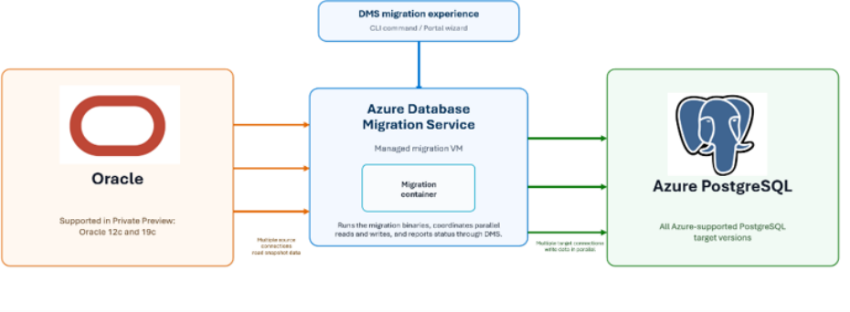

# Oracle to PostgreSQL Data Migration - Private Preview
## Overview
This service enables you to migrate data from Oracle databases to Azure Database for PostgreSQL Flexible Server as part of the Private Preview. The sections below describe what the service does, its key capabilities, and how to get onboarded. 

## What is this service?
- Migrates data from Oracle databases to Azure Database for PostgreSQL Flexible Server 

- Private Preview supports offline (snapshot-based) migration only. 

- There are no charges associated with using the migration service to copy data from Oracle to PostgreSQL. 

- Takes a consistent snapshot of the source Oracle database and copies it to the target PostgreSQL database 

- Changes made to the source database after migration starts are not synchronized. 

- Applications must remain offline for the duration of the migration and should be planned during an approved maintenance window. 

## Key Capabilities
1. Fully managed migration experience with no additional migration infrastructure to deploy or manage. 

2. Ability to migrate large enterprise databases, including multi-terabyte workloads. 

3. End-to-end guidance and support from the Microsoft product and engineering teams throughout the Private Preview. 

## Onboarding
To get started, fill out the [private preview onboarding form](https://forms.cloud.microsoft/Pages/ResponsePage.aspx?id=v4j5cvGGr0GRqy180BHbR6c8V_Hp4R1PhIpLDNYckC1UOEpFTzJOQVFNVU5EUU5LNzJaUlo5NkxaVy4u). We'll review your submission and get back to you as soon as possible with updates on your onboarding progress. Depending on capacity and region availability, you could be up and running sooner than you think — onboarding will be completed within 5 business days. 

## How it works



1. The migration is initiated through the Azure portal wizard or CLI command 

2. Azure DMS provisions a managed migration VM with migration containers that orchestrate the entire migration 

3. The migration container opens multiple parallel connections to the source Oracle database to read snapshot data simultaneously 

4. Data read is staged in DMS VM’s memory and written to Azure PostgreSQL through multiple parallel target connections, maximizing throughput. 

## Before you begin
Before you start your first migration, review the supported configurations, install the required tools, grant the necessary database permissions, and confirm your connectivity requirements. 

### Supported configurations
|**Component**|**Supported**|
|---|---|
|Oracle versions|19c|
|PostgreSQL versions|All versions supported in Azure PostgreSQL (14, 15, 16, 17, 18)|
|Azure Database for PostgreSQL|**Flexible Server**. Support for **HorizonDB** will be introduced later.|
|Migration Mode|Offline|
|Database Size|Multi-TBs|
|Regions|East US 2, West Europe, Southeast Asia, Central India, and France Central. Region availability will expand over time.|


### Tools to install
- **Azure CLI —** The Private Preview is accessible via Azure Resource Manager endpoints through the Azure CLI. To get started, [download and install the Azure CLI](https://learn.microsoft.com/cli/azure/install-azure-cli) if you haven't already. If you have an existing installation, verify your version by running `az version` — version **2.68.0 or above** is required. If your version is older, run `az upgrade` to update to the latest version. 

- **PowerShell 7 (or later)** The Private Preview migration commands are written in PowerShell, which runs on Windows, macOS, and Linux. Download and install it from the official page: [Install PowerShell](https://learn.microsoft.com/powershell/scripting/install/installing-powershell). 

- **Azure PowerShell (Az module) —** The commands use the **Get-AzAccessToken** cmdlet to authenticate. After installing PowerShell 7, install the Az module by running: 

```
Install-Module -Name Az -Scope CurrentUser -Repository PSGallery -Force
```

Then sign in to Azure account using: 

```
Connect-AzAccount
```

- **Azure portal —** A portal-based migration experience is planned for **August**, requiring no additional tools or installations. 

### Required permissions
#### Oracle migration user
|**Privilege**|**Purpose**|
|---|---|
|`GRANT CREATE SESSION TO <oracle_user>;`|Connect to the source Oracle database.|
|`GRANT SELECT ANY TABLE TO <oracle_user>;`|Read table data to migrate.|
|`GRANT SELECT ANY SEQUENCE TO <oracle_user>;`|Read sequence values.|
|`GRANT SELECT ANY DICTIONARY TO <oracle_user>;`|Read metadata (schemas, tables, data types).|
|`GRANT FLASHBACK ANY TABLE TO <oracle_user>;`|Read a consistent point-in-time snapshot.|
|`GRANT EXECUTE ON SYS.DBMS_FLASHBACK TO <oracle_user>;`|Obtain the snapshot SCN for consistent reads.|


#### Azure PostgreSQL migration user
|**Privilege**|**Purpose**|
|---|---|
|`GRANT azure_pg_admin TO <postgresql_user>;`|Write access to insert migrated data into the target tables.|


### Connectivity requirements (networking, ports, and firewall)
DMS must be able to connect to both the Oracle source database and the Azure Database for PostgreSQL target database before migration can start. The migration worker establishes outbound connections to both endpoints using their native database protocols. 

### Prerequisites
- Oracle listener must be running and accessible. 

- Firewalls and network security rules must allow connections from DMS to both source and target databases. 

- Source and target database hostnames must be resolvable from DMS. 

- Ensure that the public IP range **20.240.138.64/30** is whitelisted in firewalls and network security rules to enable migration connectivity. 

## Tutorial: Your first migration
### Set your parameters
Edit the values in the block below to match your environment. This is the only block you need to change — every later command reuses these variables. 

```powershell
# ---------- ARM / service parameters ----------
$base = "https://management.azure.com"
$sub  = "<subscription_id>"
$rg   = "<resource_group>"
$svc  = "<name_for_your_database_migration_service>"
$api  = "2025-01-10-preview" # API version
$loc  = "swedencentral"      # Service location
# --- Oracle source ---
$srcConnName   = "OracleSource" # Logical connection name. Keep it as-is.
$srcHost       = "<host_ip_oracle_server>"
$srcPort       = 1521
$srcDb         = "<service_name>"
$srcUser       = "<schema_name>"
$srcPass       = "<password_for_schema>"
$srcSchema     = "<schema_name>"
# --- Azure Database for PostgreSQL Flexible Server (target) ---
$tgtServer     = "<name_of_postgresql_server>" # Flexible Server resource name
$tgtConnName   = "PostgreSqlTarget"             # Logical connection name. Keep it as-is.
$tgtHost       = "$tgtServer.postgres.database.azure.com"
$tgtPort       = 5432
$tgtDb         = "<target_db_name>"
$tgtUser       = "<admin_user_name>"
$tgtPass       = "<admin_user_name_password>"
$tgtSchema     = "public" # Keep this as-is.

$tgtServerResourceId = "/subscriptions/$sub/resourceGroups/$rg/providers/Microsoft.DBforPostgreSQL/flexibleServers/$tgtServer"
```

### Generate migration ID and Authenticate
```powershell
# A new id is generated for the migration PUT;
$migId       = [guid]::NewGuid().ToString()
$schemaMigId = $migId
$dbMigId     = $migId
```powershell

```powershell
$secure  = (Get-AzAccessToken -ResourceUrl "https://management.azure.com" -AsSecureString).Token
$token   = [System.Net.NetworkCredential]::new("", $secure).Password
$headers = @{ Authorization = "Bearer $token" }
```

### Helpers, paths and request bodies (run once)
Run this whole block before issuing any request. 

```
# ---------- Helper: poll a long-running operation to completion ----------
# The async actions (testConnectivity / discoverDatabaseObjects) and the migration
# PUT are long-running. Send them with Invoke-WebRequest so the async status URL in
# the response headers is readable, then hand the response here to poll
# Azure-AsyncOperation / Location until the operation reaches a terminal state.
function Wait-AsyncOperation {
    param([object]$Response, [hashtable]$Headers)

    Write-Host "Initial status code: $($Response.StatusCode)"
# Header values can come back as String[]; force a single string.
$statusUrl = @($Response.Headers["Azure-AsyncOperation"])[0]
    if (-not $statusUrl) { $statusUrl = @($Response.Headers["Location"])[0] }
# Not a long-running op - just return the body.
    if (-not $statusUrl) { return ($Response.Content | ConvertFrom-Json) }
    Write-Host "Polling: $statusUrl"
    do {
        Start-Sleep -Seconds 5
        $status = Invoke-RestMethod -Method GET -Uri $statusUrl -Headers $Headers -ContentType "application/json"
        Write-Host "  status = $($status.status)"
    } while ($status.status -in @("Accepted","Running","InProgress","NotStarted","Pending"))
    return $status
}
# ---------- Paths (built from the params above - no manual URL typing) ----------
$svcRoot               = "$base/subscriptions/$sub/resourceGroups/$rg/providers/Microsoft.DataMigration/databaseMigrationServices/$svc"
$createServicePath     = "$($svcRoot)?api-version=$api"
$deleteServicePath     = "$($svcRoot)?api-version=$api"
$checkConnectivityPath = "$($svcRoot)/testConnectivity?api-version=$api"
$discoverObjectsPath   = "$($svcRoot)/discoverDatabaseObjects?api-version=$api"
$migPath               = "$($svcRoot)/migrations/$($migId)?api-version=$api"
$schemaPath            = "$($svcRoot)/migrations/$($schemaMigId)/schemaStatuses?api-version=$api"
$dbPath                = "$($svcRoot)/migrations/$($dbMigId)/databaseStatuses?api-version=$api"
# ---------- Bodies ----------
$serviceBody = @{
    location   = $loc
    tags       = @{ environment = "test" }
    properties = @{}
} | ConvertTo-Json -Depth 10
$migBody = @{
    properties = @{
        migrationName        = "Oracle to PostgreSQL Migration"
        description          = "Migrating from Oracle to Azure Database for PostgreSQL Flexible Server"
        migrationMode        = "offline"
        sourceServerType     = "On-Premises"
        targetServerType     = "AzurePostgreSQLFlexibleServer"
        source               = @{
            sourceType          = "Oracle"
            serverResourceId    = ""
            connectionEndPoints = @(
                @{
                    connectionName = $srcConnName
                    hostName       = $srcHost
                    port           = $srcPort
                    serviceName    = $srcDb
                    databaseName   = $srcDb
                    credentials    = @{ authenticationMethod = "password"; userName = $srcUser; password = $srcPass }
                    ssl            = @{ mode = "prefer" }
                }
            )
        }
        target               = @{
            targetType          = "Azure Database for PostgreSQL"
            serverResourceId    = $tgtServerResourceId
            connectionEndPoints = @(
                @{
                    connectionName = $tgtConnName
                    hostName       = $tgtHost
                    port           = $tgtPort
                    databaseName   = $tgtDb
                    credentials    = @{ authenticationMethod = "password"; userName = $tgtUser; password = $tgtPass }
                    ssl            = @{ mode = "require" }
                }
            )
        }
        mappingDefinitions   = @(
            @{
                mappingScope         = "schema"
                sourceDatabaseName   = $srcDb
                targetDatabaseName   = $tgtDb
                sourceSchemaName     = $srcSchema
                targetSchemaName     = $tgtSchema
                sourceConnectionName = $srcConnName
                targetConnectionName = $tgtConnName
            }
        )
        migrationJobSettings = @()
    }
} | ConvertTo-Json -Depth 20
```

### Create the migration service
The migration service is the Azure resource that orchestrates your migration. Create it once with the PUT command below; you’ll reuse it for all migrations. 

```powershell
Invoke-RestMethod -Method PUT -Uri $createServicePath -Headers $headers `
    -ContentType "application/json" -Body $serviceBody | ConvertTo-Json -Depth 10
```

**Note:** Provisioning takes a short while. Run the GET below to check the service status — repeat it until the provisioning state reports **Succeeded** . 

```powershell
Invoke-RestMethod -Method GET -Uri $createServicePath -Headers $headers `
    -ContentType "application/json" | ConvertTo-Json -Depth 10
```

### Start your migration
With the migration service provisioned, you’re ready to start migration itself. Use the freshly generated `$migId` to start a migration. 

```powershell
try {
    $migResp = Invoke-WebRequest -Method PUT -Uri $migPath -UseBasicParsing `
        -Headers $headers -ContentType "application/json" -Body $migBody
    Wait-AsyncOperation -Response $migResp -Headers $headers | ConvertTo-Json -Depth 20
} catch {
    Write-Warning "Start migration failed: $($_.Exception.Message)"
    if ($_.ErrorDetails.Message) { Write-Host $_.ErrorDetails.Message }
}
```

### Check the migration status
The migration runs in the background. Run the command below at any time to check its status. 

```powershell
Invoke-RestMethod -Method GET -Uri $migPath -Headers $headers `
    -ContentType "application/json" | ConvertTo-Json -Depth 20
```powershell

Look at the migration’s status in the response to understand where it is: 

- **In progress** — the migration is actively copying data. Re-run the command periodically to watch progress. 

- **Succeeded** — the migration completed successfully. Continue to validation and cutover. 

- **Failed** — the migration didn’t complete. Review the error details in the response. We’ll debug the failure with you and provide an RCA. 

- **Canceled** — the migration was stopped (see Step 6). 

### Cancel an ongoing migration
If you need to stop a migration that’s in progress — for example, you started it with the wrong parameters or need to reschedule your maintenance window — cancel it with the PATCH command below. 

```powershell
$cancelBody = @{
    properties = @{ migrationOperationType = "Cancel" }
} | ConvertTo-Json -Depth 10
```

```
Invoke-RestMethod -Method PATCH -Uri $migPath -Headers $headers -ContentType "application/json" -Body $cancelBody
```

This submits a cancel request for the migration identified by `$migId` . Confirm it was canceled by running the status check from Step 6 and looking for a **Canceled** state. 

## FAQ
### Does the service migrate both schema and data, or just data?
The migration service handles **data movement only** between Oracle and PostgreSQL databases. Schema conversion is a separate capability, available through the VS Code extension (generally available). [Learn more about schema conversion](https://learn.microsoft.com/azure/postgresql/migrate/oracle-conversions-schema/schema-conversions-overview). 

### Are there any Oracle data types for which the migration service will not be able to copy data?
- `SDO_GEOMETRY`
- Abstract Data Types (ADTs), including `VARRAY`, nested tables, and `REF` types
- `BFILE`
- `VECTOR`

### Will my application need downtime?
Yes. The service currently supports **offline migration**, which takes a point-in-time snapshot of your data when the migration is initiated. Your application must be stopped or set to read-only until the migration is completed. Otherwise, changes made after the snapshot won't be copied to the target, resulting in data differences between source and target. 

### What happens to changes made on the source database after the migration starts?
Any changes made to the source database after the migration is initiated will not be copied to the target. 

### What sizes are supported?
The service supports multi-terabyte workloads, with no defined upper size limit. 

### Recommended approach:
Start with a lower environment containing a smaller dataset and confirm successful migration runs. 

For production, create a copy of your production database, run the migration against it, and confirm success — noting how long the copy takes. This duration represents the expected downtime for your application. 

Use this estimate to plan and execute your production migration within a scheduled maintenance window. 

### Can I migrate multiple Oracle schemas in one migration run?
Yes. You can select multiple schemas, but each migration writes to a **single PostgreSQL database** . To map schemas to different PostgreSQL databases, create a separate migration for each target database. 

### What permissions are needed for the migration user on Oracle and PostgreSQL databases?
Refer to the Required Permissions section. 

### Is my data encrypted in transit and rest during the migration?
Yes. Data is fully encrypted both in transit and at rest throughout the migration. 

### Does my data stay within my chosen Azure region?
DMS sits between the source and target servers. As a best practice, provision your target PostgreSQL server and DMS as close to the source as possible. If DMS is in the same region as the source and target, data does not cross Azure regions. If DMS is in a different region, data travels across regions along the path Source -> DMS -> Target. 

### How do I validate that all my data has been migrated successfully?
Data validation is not currently part of the migration service. In the meantime, use your own scripts or third-party tools to verify the migration. We plan to introduce built-in data validation in the future release. 

## Limitations and known issues
1. **Offline migration only** - The service currently supports offline migration only. Your application must be stopped or set to read-only during the migration. Support for online (near-zero-downtime) migration will be introduced in a later phase. 

2. **Public connectivity only -** Azure DMS connects to the source and target databases over public IPs. Connectivity over private IPs (private endpoints / private tunneling) is not supported today and will be introduced in the next phase. 

3. **Username/password authentication only** - Migration users must authenticate using username and password for both Oracle and Azure Database for PostgreSQL. Support for wallet-based authentication and managed identity authentication will be added later. 

4. **Schema-level selection -** You can select the schemas you want to migrate, but not individual tables within a schema. The service migrates table data only (not schema objects — schema conversion is handled separately via the VS Code extension). Table-level granularity will be introduced in a later phase. 

5. **Table names must match between source and target.** Table names must match between the source and target for data to be migrated. Any table whose name does not match between source and target will not be migrated. 

6. **Unsupported data types -** Tables containing columns with the following data types are not supported: 

   - SDO_GEOMETRY 

   - Abstract Data Types (ADTs) - Columns using Oracle user-defined object types, including VARRAY, nested tables, and REF types, cannot be migrated. 

   - BFILE 

   - VECTOR 

7. **One active migration per target server** - Only one active migration can run against a given Azure PostgreSQL Flexible Server at a time. Multiple parallel migrations to the same target server are not supported. 

## Support and feedback
The Private Preview is a **white-glove engagement** — the Microsoft product and engineering team works directly with you throughout your migration. 

For any **failed or stalled migration** , we'll debug the issue together, provide a **root cause analysis (RCA)** , and share an **ETA for the fix or workaround** . 

- Reach us at [migrationpm@service.microsoft.com](mailto:migrationpm@service.microsoft.com) 

To help us assist you faster, please have the following ready when you reach out: 

- Migration ID and approximate timestamp of the issue 

- Source Oracle and target PostgreSQL versions 

- The error message or a screenshot 


